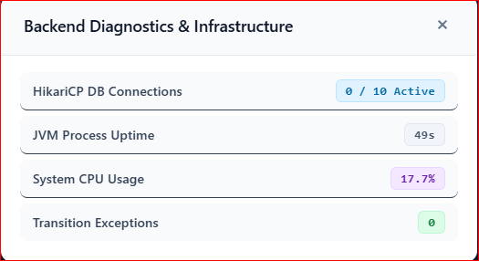
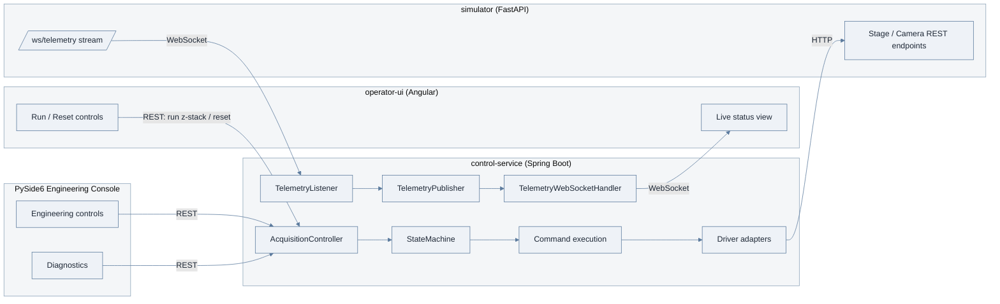
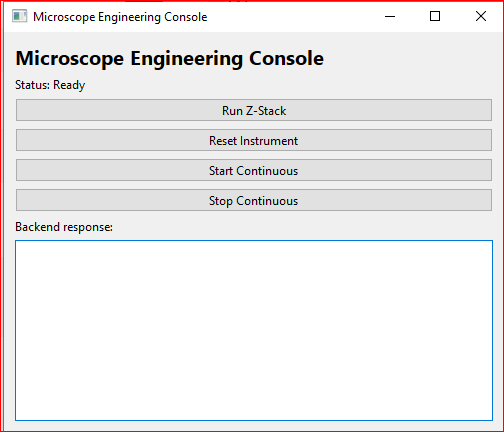
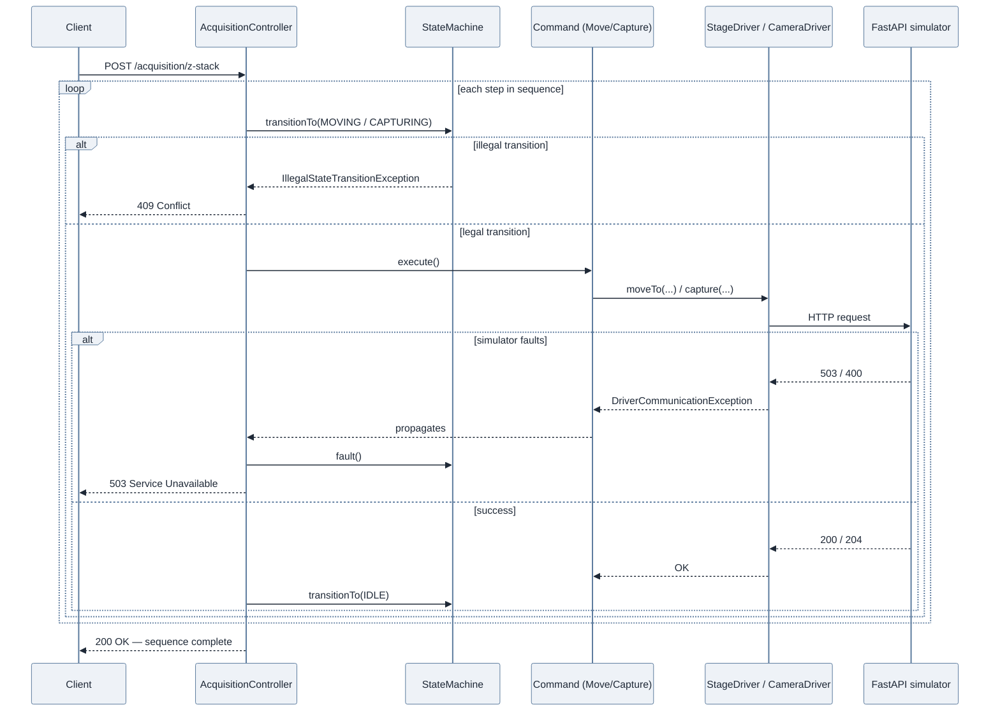
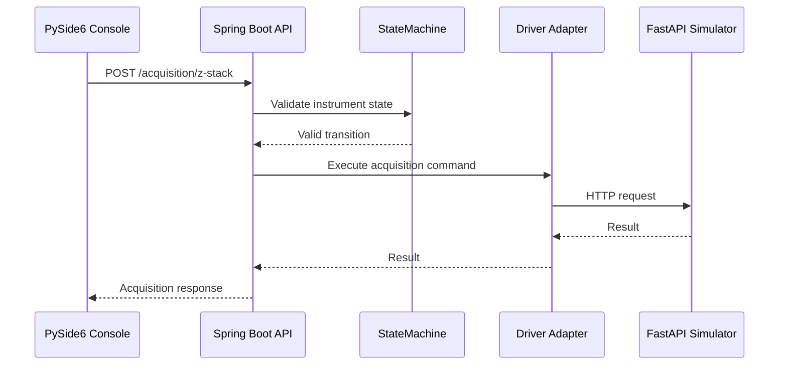

# Microscope Control Platform

A simulated instrument-control system for a microscope, built to explore the kind of software an imaging/instrumentation team actually needs: real-time hardware orchestration, safety interlocks, and live telemetry.

The project deliberately mirrors a real microscopy acquisition workflow (move the stage, expose the camera, repeat) using a simulated "hardware" layer instead of physical instruments, so the full software stack can be built, tested, and demonstrated without lab equipment.

## Dashboard Preview

<div align="center">

  

  <br /><br />
 
</div>

## System Metrics & Diagnostics

To ensure operational reliability and high availability during intensive imaging acquisition runs, the `control-service` collects and exposes real-time backend infrastructure telemetry.

### Key Metrics Monitored

* **HikariCP DB Connection Pool**: Tracks active vs. total connections allocated for acquisition metadata persistence, preventing connection leaks during rapid telemetry streaming.

* **JVM Process Uptime**: Monitors runtime longevity and lifecycle events to help detect unexpected restarts or memory recovery issues.

* **System CPU Usage**: Tracks real-time CPU consumption across thread pools executing asynchronous command blocks and WebSocket push broadcasts.

* **State & Transition Faults**: Monitors frequency of caught safety interlock violations, simulator hardware stalls, and camera exposure failures.

### Telemetry & Diagnostics Architecture

The platform consists of independent components, each with a focused responsibility:



- **`simulator/`** — stands in for real stage/camera hardware. Deliberately "dumb": it just simulates physics (move timing proportional to distance, exposure timing), enforces stage travel bounds, and randomly injects faults (~3% stage stall, ~2% camera fault) so the Java layer has real failures to react to, not just a happy path.

- **`control-service/`** — owns all orchestration, sequencing, safety logic, and reproducibility. Never contains hardware-specific code directly; only talks to hardware through driver interfaces.

- **`operator-ui/`** — the Angular front-end an operator would actually use to run acquisitions and watch live instrument state.

- **`desktop/pyside6-console/`** — a lightweight PySide6/Qt desktop application used as an engineering and diagnostic client. It communicates with the same Spring Boot control service as the Angular UI.

### PySide6 Engineering Console

The project includes a lightweight **PySide6 (Qt) desktop engineering console** for instrument testing and diagnostics.

The desktop console is intentionally smaller than the main Angular operator interface. It is designed as an engineering-oriented client rather than a second implementation of the operator dashboard.
<div align="center">


 <br /><br />
</div>

Current capabilities include:

- Manual instrument commands
- Z-stack testing
- Instrument reset
- Continuous acquisition control
- Backend communication testing
- Displaying backend responses
- Displaying current instrument status
- Engineering diagnostics

Both the Angular application and the PySide6 desktop console communicate with the same Spring Boot control service — as independent clients, not chained through one another.

```text
Angular Operator UI  ---REST / WebSocket---\
                                             \
                                              >--->  Spring Boot Control Service
                                             /              |
PySide6 Engineering Console  ---REST-------/               v
                                                    Driver Adapters
                                                             |
                                                             v
                                                    FastAPI Hardware Simulator
```

This demonstrates that the acquisition and instrument-control logic is independent of the presentation technology.

The PySide6 console also provides a foundation for future engineering functionality such as acquisition parameter configuration, device diagnostics, calibration workflows, and local hardware/SDK integration.

## Design patterns used

| Pattern | Where | Problem it solves |
|---|---|---|
| **Adapter** | `driver/` (`StageDriver`, `CameraDriver` interfaces + `FastApi*Driver` implementations) | Orchestration logic never knows it's talking to a simulator instead of real hardware. Swapping to real instruments later means writing a new adapter, not touching business logic. |
| **Command** | `command/` (`MoveCommand`, `CaptureCommand`) | Each hardware action is an object with `execute()` and `describe()`, so a full sequence can be built, logged, and run without the runner caring which concrete action it's holding. |
| **Builder** | `command/AcquisitionSequenceBuilder` | Separates *planning* an acquisition from *running* it — a full sequence is assembled and validated before a single motor moves. |
| **State** | `state/StateMachine`, `InstrumentState` | Enforces legal transitions (e.g. can't start a move while capturing) *before* any driver is touched. This is where the safety-interlock story lives. |
| **Observer** | `telemetry/TelemetryPublisher`, `TelemetryListener`, `TelemetryWebSocketHandler` | Decouples "where telemetry comes from" (the simulator's WebSocket) from "who consumes it" (currently just the relay to Angular, but any number of subscribers could be added — logging, alerting — without touching the source). |

## Request flow: running an acquisition

This is the sequence behind `POST /acquisition/z-stack` — the guard happens *before* any driver is touched, and a failure short-circuits the whole sequence rather than continuing partway:



Recovering from a fault is a separate, explicit action (`POST /acquisition/reset`) — the state machine will not accept new commands on its own after a fault, by design.

- ✅ Full acquisition sequence (z-stack: move → capture → repeat) executes end-to-end: REST call → Java orchestration → real HTTP calls to the Python simulator → simulated stage/camera state changes → response.

- ✅ Simulated hardware faults (stage stall, camera fault) correctly propagate as `DriverCommunicationException`, get caught, and trigger `StateMachine.fault()` — the instrument reports a clean `503`, not a raw stack trace.

- ✅ Once faulted, the instrument **correctly refuses new commands** (`409 Conflict`, "Cannot transition from FAULT to ...") until an explicit `/acquisition/reset` call — modeling a human operator having to acknowledge a fault rather than silent auto-recovery.

- ✅ Live telemetry streams from the simulator, through Java (which merges in its own `InstrumentState`), out to any connected WebSocket client — verified showing real-time `IDLE → MOVING → CAPTURING → IDLE` transitions during an actual running sequence.

## PySide6 desktop request flow

The engineering console uses the same backend APIs as the operator UI.

For example, running a Z-stack from the desktop console follows:



The desktop application therefore remains a client of the instrument-control layer rather than implementing acquisition logic itself.

## Simulator (`simulator/`, default port 8000)

| Method | Path | Purpose |
|---|---|---|
| POST | `/stage/move` | Move the simulated stage to `{x, y, z}` |
| GET | `/stage/position` | Current stage position |
| POST | `/camera/capture` | Trigger an exposure of `exposureMs` |
| GET | `/camera/status` | Current camera state + last frame id |
| WS | `/ws/telemetry` | Live position/camera state, pushed every 0.5s |
| GET | `/health` | Liveness check |
| GET | `/docs` | Interactive Swagger UI (auto-generated) |

## Control service (`control-service/`, default port 8080)

| Method | Path | Purpose |
|---|---|---|
| POST | `/acquisition/z-stack` | Run a basic z-stack sequence |
| POST | `/acquisition/reset` | Clear a `FAULT` state back to `IDLE` |
| POST | `/acquisition/continuous/start` | Start continuous acquisition |
| POST | `/acquisition/continuous/stop` | Stop continuous acquisition |
| WS | `/ws/telemetry` | Live telemetry, relayed from the simulator + merged with instrument state |

## Getting started

### 1. Start the simulator first

The `control-service` telemetry listener connects to the simulator on startup.

```bash
cd simulator

python -m venv venv

venv\Scripts\activate
# macOS/Linux: source venv/bin/activate

pip install -r requirements.txt

python -m uvicorn app.main:app --reload --port 8000
```

Verify it's up at:

`http://127.0.0.1:8000/docs`

### 2. Start the control service

```bash
cd control-service

mvn spring-boot:run
```

The control service runs on port `8080`.

### 3. Start the PySide6 engineering console

From the repository root:

```bash
python desktop\pyside6-console\main.py
```

The PySide6 console connects to the Spring Boot control service running on:

`http://localhost:8080`

The current engineering console provides buttons for:

- Run Z-Stack
- Reset Instrument
- Start Continuous
- Stop Continuous

and displays the backend response returned by the control service.

### 4. Try it out

- Run a sequence: `POST http://localhost:8080/acquisition/z-stack`

- Watch live telemetry: `npx wscat -c ws://localhost:8080/ws/telemetry`

- Check the simulator directly: `GET http://127.0.0.1:8000/stage/position`

- Start the engineering desktop console:
  `python desktop\pyside6-console\main.py`

- Stage/camera moves here are synchronous/blocking; a real instrument would likely need an async/event-driven state model, since a real stage move can take much longer and the system should report `MOVING` progress rather than just blocking.

- Real instrument communication is often serial or a vendor-specific SDK rather than REST — the Adapter pattern here is what would absorb that difference without touching orchestration logic.

- Acquisition metadata would need to be persisted (a database, or structured files like OME-TIFF metadata) rather than kept in memory, to actually support reproducibility long-term.

## Engineering Console Design

The PySide6 application is deliberately kept lightweight.

The current structure is:

```text
desktop/
└── pyside6-console/
    ├── main.py
    ├── main_window.py
    └── api_client.py
```

Responsibilities are separated so that:

- `main.py` starts the Qt application.
- `main_window.py` contains the desktop UI.
- `api_client.py` handles communication with the Spring Boot backend.

This keeps HTTP communication separate from the desktop presentation layer and allows the console to evolve independently.

The desktop application does not directly implement the microscope acquisition workflow. Instead, it invokes the Spring Boot APIs, allowing the same state machine, commands, driver adapters, and safety logic to be reused.

## Future Engineering Extensions

The PySide6 console provides a foundation for additional engineering-oriented capabilities.

Potential extensions include:

- Configurable Z-stack parameters
- Acquisition recipe selection
- Stage position inspection
- Camera status and diagnostics
- Hardware health monitoring
- Calibration workflows
- Engineering log viewer
- Local hardware/vendor SDK integration
- Acquisition progress monitoring
- Image preview and basic scientific analysis

These extensions can be added without moving orchestration logic into the desktop application.

## Tech stack

- **Python** — FastAPI, Pydantic, uvicorn
- **Java 17** — Spring Boot, Spring WebFlux (`WebClient`), Spring WebSocket, Lombok
- **Angular** — operator-facing web application
- **PySide6 / Qt** — engineering and diagnostic desktop console
