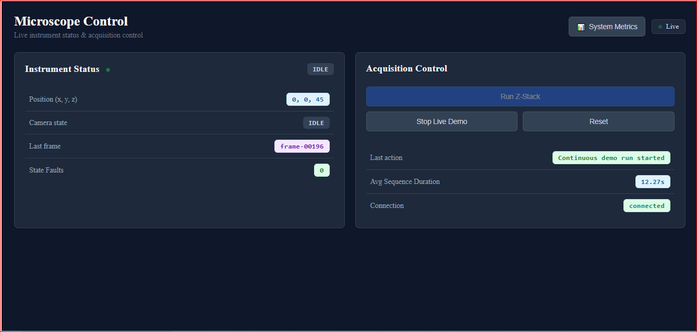
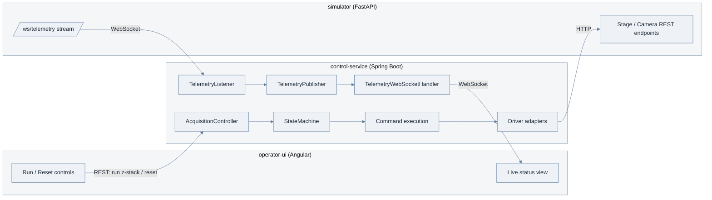
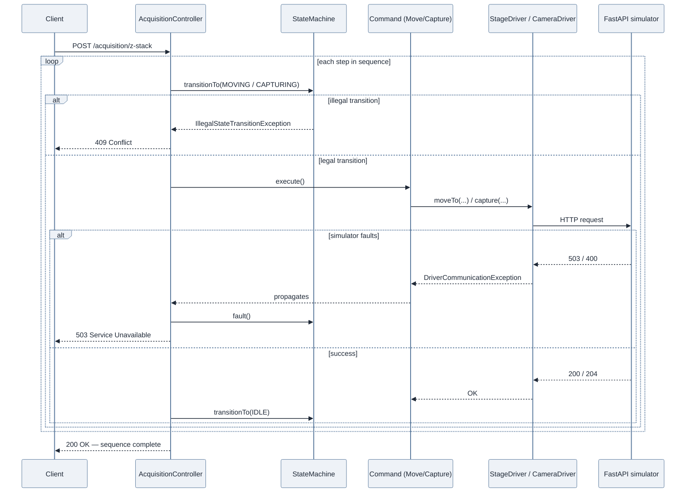

# Microscope Control Platform

A simulated instrument-control system for a microscope, built to explore
the kind of software an imaging/instrumentation team actually needs:
real-time hardware orchestration, safety interlocks, and live telemetry.


The project deliberately mirrors a real microscopy acquisition workflow
(move the stage, expose the camera, repeat) using a simulated "hardware"
layer instead of physical instruments, so the full software stack can be
built, tested, and demonstrated without lab equipment.

## Dashboard Preview

<div align="center">
  
 </div>

## Architecture

Three independent services, each with its own language and
responsibility:



- **`simulator/`** — stands in for real stage/camera hardware. Deliberately
  "dumb": it just simulates physics (move timing proportional to distance,
  exposure timing), enforces stage travel bounds, and randomly injects
  faults (~3% stage stall, ~2% camera fault) so the Java layer has real
  failures to react to, not just a happy path.
- **`control-service/`** — owns all orchestration, sequencing, safety
  logic, and reproducibility. Never contains hardware-specific code
  directly; only talks to hardware through driver interfaces.
- **`operator-ui/`** — the Angular front-end an operator would actually
  use to run acquisitions and watch live instrument state. *(not yet built)*

## Design patterns used


| Pattern | Where | Problem it solves |
|---|---|---|
| **Adapter** | `driver/` (`StageDriver`, `CameraDriver` interfaces + `FastApi*Driver` implementations) | Orchestration logic never knows it's talking to a simulator instead of real hardware. Swapping to real instruments later means writing a new adapter, not touching business logic. |
| **Command** | `command/` (`MoveCommand`, `CaptureCommand`) | Each hardware action is an object with `execute()` and `describe()`, so a full sequence can be built, logged, and run without the runner caring which concrete action it's holding. |
| **Builder** | `command/AcquisitionSequenceBuilder` | Separates *planning* an acquisition from *running* it — a full sequence is assembled and validated before a single motor moves. |
| **State** | `state/StateMachine`, `InstrumentState` | Enforces legal transitions (e.g. can't start a move while capturing) *before* any driver is touched. This is where the safety-interlock story lives. |
| **Observer** | `telemetry/TelemetryPublisher`, `TelemetryListener`, `TelemetryWebSocketHandler` | Decouples "where telemetry comes from" (the simulator's WebSocket) from "who consumes it" (currently just the relay to Angular, but any number of subscribers could be added — logging, alerting — without touching the source). |

## Request flow: running an acquisition

This is the sequence behind `POST /acquisition/z-stack` — the guard
happens *before* any driver is touched, and a failure short-circuits
the whole sequence rather than continuing partway:



Recovering from a fault is a separate, explicit action
(`POST /acquisition/reset`) — the state machine will not accept new
commands on its own after a fault, by design.

- ✅ Full acquisition sequence (z-stack: move → capture → repeat) executes
  end-to-end: REST call → Java orchestration → real HTTP calls to the
  Python simulator → simulated stage/camera state changes → response.
- ✅ Simulated hardware faults (stage stall, camera fault) correctly
  propagate as `DriverCommunicationException`, get caught, and trigger
  `StateMachine.fault()` — the instrument reports a clean `503`, not a
  raw stack trace.
- ✅ Once faulted, the instrument **correctly refuses new commands**
  (`409 Conflict`, "Cannot transition from FAULT to ...") until an
  explicit `/acquisition/reset` call — modeling a human operator having
  to acknowledge a fault rather than silent auto-recovery.
- ✅ Live telemetry streams from the simulator, through Java (which
  merges in its own `InstrumentState`), out to any connected WebSocket
  client — verified showing real-time `IDLE → MOVING → CAPTURING → IDLE`
  transitions during an actual running sequence.

### Simulator (`simulator/`, default port 8000)

| Method | Path | Purpose |
|---|---|---|
| POST | `/stage/move` | Move the simulated stage to `{x, y, z}` |
| GET | `/stage/position` | Current stage position |
| POST | `/camera/capture` | Trigger an exposure of `exposureMs` |
| GET | `/camera/status` | Current camera state + last frame id |
| WS | `/ws/telemetry` | Live position/camera state, pushed every 0.5s |
| GET | `/health` | Liveness check |
| GET | `/docs` | Interactive Swagger UI (auto-generated) |

### Control service (`control-service/`, default port 8080)

| Method | Path | Purpose |
|---|---|---|
| POST | `/acquisition/z-stack` | Run a basic z-stack sequence |
| POST | `/acquisition/reset` | Clear a `FAULT` state back to `IDLE` |
| WS | `/ws/telemetry` | Live telemetry, relayed from the simulator + merged with instrument state |

## Getting started

**1. Start the simulator first** (control-service's telemetry listener
connects to it on startup):

```bash
cd simulator
python -m venv venv
venv\Scripts\activate          # on macOS/Linux: source venv/bin/activate
pip install -r requirements.txt
python -m uvicorn app.main:app --reload --port 8000
```

Verify it's up at `http://127.0.0.1:8000/docs`.

**2. Start the control service:**

```bash
cd control-service
mvn spring-boot:run
```

**3. Try it out:**

- Run a sequence: `POST http://localhost:8080/acquisition/z-stack`
- Watch live telemetry: `npx wscat -c ws://localhost:8080/ws/telemetry`
- Check the simulator directly: `GET http://127.0.0.1:8000/stage/position`

- Stage/camera moves here are synchronous/blocking; a real instrument
  would likely need an async/event-driven state model, since a real
  stage move can take much longer and the system should report  `MOVING` progress rather than just blocking.
- Real instrument communication is often serial or a vendor-specific
  SDK rather than REST — the Adapter pattern here is what would absorb
  that difference without touching orchestration logic.
- Acquisition metadata would need to be persisted (a database, or
  structured files like OME-TIFF metadata) rather than kept in memory,
  to actually support reproducibility long-term.

## Tech stack

- **Python** — FastAPI, Pydantic, uvicorn
- **Java 17** — Spring Boot, Spring WebFlux (`WebClient`), Spring
  WebSocket, Lombok
- **Angular** — *(planned)*
